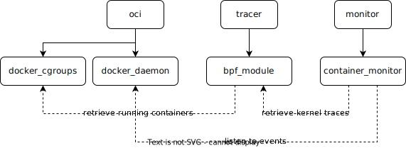

# ctrace

`ctrace` is a low-level system tracer for Docker containers. It traces system calls and Linux capabilities usage of specified containers into a human-readable file. Trace results can be converted into Docker restrictions, specifically a `seccomp` profile of allowed system calls, and Docker run options for dropping unused Linux capabilities.

The rationale for tracing containers is to increase the security of containerized applications. Knowing exactly which system calls and Linux capabilities a given container needs allows the creation of ad-hoc security profiles which restrict any superfluous permission and potentially prevent exploitation.

One of the ways container engines reach isolation and improved security is through limiting which system calls and Linux capabilities are allowed inside containers. Docker, for example, blocks 44 system calls and allows 14 Linux capabilities according to their documentation:

- [Seccomp security profiles for Docker](https://docs.docker.com/engine/security/seccomp/)
- [Runtime privilege and Linux capabilities](https://docs.docker.com/engine/reference/run/#runtime-privilege-and-linux-capabilities)

These restrictions can, however, be configured by the user to be more (or less) restrictive. Since the default security restrictions are generalized to work with most containerized applications, they are inevitably too permissive for any given containerized application. With `ctrace`, it is possible to make such security profiles as tight as any given application requires.

## Usage

### Quick Start

As runtime dependencies, kernel headers are required in `/usr/src`. These can be installed by most package managers with `linux-headers-$(uname -r)`.  
Since only Docker containers can be traced, Docker is, of course, a dependency, as well as Docker Compose.

The container tracer daemon can be run from a privileged container and started with:

```console
$ docker-compose up
ctrace | Waiting for Docker events
```

Once the `ctrace` daemon is started, containers can be traced by specifying a `ctrace.tracefile` label whose value is the file name of the resulting trace result:

```console
$ docker run --label ctrace.tracefile=myapp-trace myapp
```

As traced containers use system calls and Linux capabilities, these are continuously written to the specified file (`myapp-trace`), by default in the `data` directory of the `ctrace` path:

```console
$ cat data/mytrace-app
ARCH
x86_64

CAPABILITIES
net_raw

SYSCALLS
bind
close
execve
open
sendto
```

### Local Installation

While the tracer daemon can be started inside a privileged container, installing it locally enables the access to all features.

A local installation requires the BPF Compiler Collection, Docker API, and `seccomp` Python 3 packages.

On a Debian-based system, the requirements are packaged in the default repository:

- `linux-headers-$(uname -r)`
- `python3-bpfcc`
- `python3-docker`
- `python3-seccomp`

The additional `ctrace` features can be used by invoking the Python module:

```console
$ python3 -m ctrace
```

### Commands

```
usage: ctrace [-h] {trace,options,diff,requirements,capability,syscall} ...

positional arguments:
  {trace,options,diff,requirements,capability,syscall}
    trace               Start tracing annotated containers
    options             Generate run options with restrictions
    diff                Compare two Tracefiles
    requirements        Generate Tracefile for minimal runtime requirements
    capability          Look up a capability
    syscall             Look up a syscall

optional arguments:
  -h, --help            show this help message and exit
```

#### `trace`

```
usage: ctrace trace [-h] [--runc] [--debug]

optional arguments:
  --runc      Trace runc before container start
  --debug     Write eBPF events to kernel trace pipe
```

Start the tracer daemon and trace existing Docker containers and newly-created ones with a `ctrace.tracefile` label. Write trace results of such containers to the file specified as the value of the label.  
The path specified as value label is formatted with `strftime`, meaning date tokens are expanded to the current date. For example, `ctrace.tracefile=myapp-%Y-W%V` generates a file named `myapp-2022-W01` for the first week of 2022. This is useful for tracing long-running containers which are regularly updated.

With the `--runc` flag, trace the container creation steps so that system calls used by Docker to set up the container environment are also part of the trace result. Such system calls must be part of any `seccomp` profile in order for it to be valid and successfully allow the creation of a container, but the usage of the [`requirements`](#requirements) command is recommended instead.

With the `--debug` flag, log all traced kernel events to the kernel debug facility, accessible with `cat /sys/kernel/debug/tracing/trace_pipe`.

#### `capability`, `syscall`

```
usage: ctrace (capability|syscall) [-h] [query]

positional arguments:
  query       ID or name to search
```

List system calls and Linux capabilities by their number or name in the current architecture and Linux version. Just as a convenient lookup feature with no relation to tracing.

#### `diff`

```
usage: ctrace diff [-h] Tracefile Tracefile

positional arguments:
  Tracefile   Tracefile to compare
```

Compare two tracefiles and print a their differences in a `diff`-like unified format:

```
CAPABILITIES
+net_raw

SYSCALLS
-open
-bind
+close
```

#### `options`

```
usage: ctrace options [-h] --output OUTPUT Tracefile [Tracefile ...]

positional arguments:
  Tracefile        File or directory with Tracefiles

optional arguments:
  -h, --help       show this help message and exit
  --output OUTPUT  Path of the resulting seccomp profile
```

Given a list of trace results, generate the Docker options for the "run" command so that the container is restricted to only the system calls and Linux capabilities specified in the trace results.  
Trace results can be specified as absolute or relative path to the resulting Tracefile from traces, but also as a directory. In such cases, all Tracefiles in the directory, recursively explored, are used.

The `--output` option specifies the path of the resulting `seccomp` profile.

The generated options (combination of `--cap-drop`, `--cap-add`, `--security-opt`) can be used in a `docker run` invocation:

```console
$ ctrace options --output data/myapp.json data/Tracefile
--cap-drop=ALL --cap-add=DAC_OVERRIDE --cap-add=NET_RAW --security-opt=seccomp:data/myapp.json

$ docker run --cap-drop=ALL --cap-add=DAC_OVERRIDE --cap-add=NET_RAW --security-opt=seccomp:data/myapp.json myapp
```

#### `requirements`

```
usage: ctrace requirements [-h] --output OUTPUT

optional arguments:
  --output OUTPUT  Path of the requirements Tracefile
```

Generate a Tracefile containing the system calls required to create and start a container. The resulting system calls must be included in any generated `seccomp` profile, otherwise it would be incomplete and the container creation would fail.  
The output is always the same and can be used to generate `seccomp` profiles for any container; upgrades of the Docker engine may require the re-generation of this baseline Tracefile.

The `--output` option specifies the path of the resulting Tracefile.

## Architecture



The tracing mechanism is divided into 3 Python modules: `oci`, `tracer`, `monitor`.

The core `tracer` module is responsible for compiling/loading an eBPF module into the kernel and providing an interface to access the collected resuts (system calls and Linux capabilities used by containers). Once instantiated, the `tracer` module loads the eBPF module written in C residing alongside the Python source code.  
As soon as the module is loaded into the kernel, any newly-created container is traced within the kernel. In order to trace containers that were running before `tracer` was started, a list of PIDs associated with containers is retrieved from the `oci.docker_cgroups` module, which provides a mapping of any PID to its container ID.

As a whole, the eBPF module does:

- Monitor newly-created cgroups by attaching to the Linux `cgroup_attach_task` raw tracepoint. These events are checked whether they are related to the creation of Docker containers. If so, the PID of processes creating the cgroup is stored.
- For any system-wide spawned process, it is checked whether the parent process is one of the processes which created a cgroup. If so, the newly-created processed is also marked as such. This check is triggered for any `sched_process_fork` event produced by Linux. A list of PIDs belonging to containers is hence available. (The list is shorten when processes exit, according to `sched_process_exit` events.)
- For any system-wide **system call**, notified via a `sys_enter` event, it is checked whether the system call originates from a process belonging to a container. If so, a counter is increased for that system call in a dictionary whose keys are the traced container IDs.
- Likewise, for **Linux capabilities**, whenever the `cap_capable` kernel probe is triggered, it is checked whether the originator process is from a container and has the Linux capability granted. A separate dictionary mapping container ID + Linux capability ID to a count of checks is maintained.

The Python `bpf_module` module can then read the metrics collected by the eBPF module, that is, which system call and Linux capabilities were used by which container ID.

The `monitor` Python module does periodically collect the metrics exposed by `bpf_module` so that they can be consumed (written to trace result files). Moreover, it reacts to any Docker containers event by listening to its socket API so that when containers exit, their metrics are immediately consumed and containers not wished to be traced (without the `ctrace.tracefile` label) are discarded from `bpf_module`.
